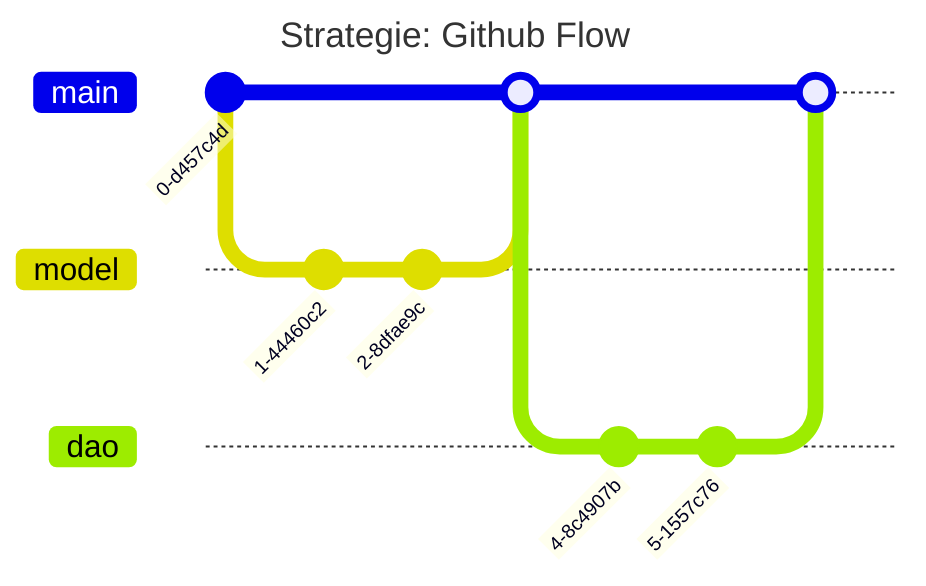
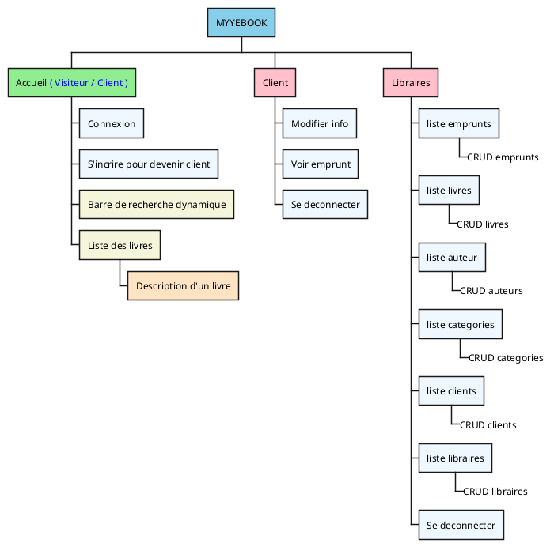
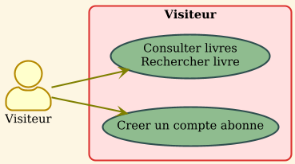
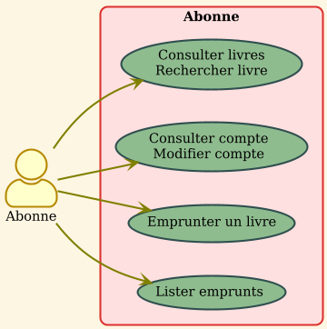
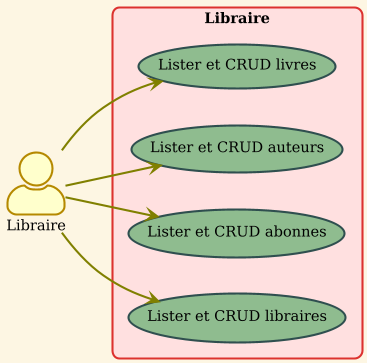
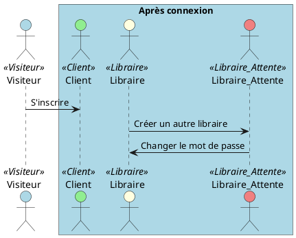

---
# You can also start simply with 'default'
theme: seriph
# random image from a curated Unsplash collection by Anthony
# like them? see https://unsplash.com/collections/94734566/slidev
background: https://cover.sli.dev
# some information about your slides (markdown enabled)
title: Welcome to Slidev
info: |
  ## Slidev Starter Template
  Presentation slides for developers.

  Learn more at [Sli.dev](https://sli.dev)
# apply unocss classes to the current slide
class: text-center
# https://sli.dev/features/drawing
drawings:
  persist: false
# slide transition: https://sli.dev/guide/animations.html#slide-transitions
transition: slide-left
# enable MDC Syntax: https://sli.dev/features/mdc
mdc: true
# light ou dark
colorSchema: light
addons:
  - excalidraw
  - slidev-component-scroll
---

# Projet Myyebook

Gestion d'une bibliothèque

<div @click="$slidev.nav.next" class="mt-12 py-1" hover:bg="white op-10">
</div>

<div class="abs-br m-6 text-xl">
  <button @click="$slidev.nav.openInEditor" title="Open in Editor" class="slidev-icon-btn">
    <carbon:edit />
  </button>
  <a href="https://github.com/mevine54/myyebook" target="_blank" class="slidev-icon-btn">
    <carbon:logo-github />
  </a>
</div>

<!--
The last comment block of each slide will be treated as slide notes. It will be visible and editable in Presenter Mode along with the slide. [Read more in the docs](https://sli.dev/guide/syntax.html#notes)
-->

---
layout: center
---

# Besoin et contrainte du projet

- **Contexte** : Projet de groupe 
- **Projet** : Site permettant de gérer une bibliothèque
- **Durée** : 1 mois environ


---
layout: full
---

# Spécificités techniques

* **Gestion de projet** : Trello
* **Wireframe** : Excalidraw
* **Front-end** : HTML5, CSS3 (Bootstrap 5), JavaScript (HTMX + SweetAlert2)
* **Serveur d'applications** : Tomcat 10
* **Back-end** : Java 21
  * **Gestion des dépendances** : Maven
    * Jakarta (Servlet et JSP), Password4J, Lombok, SLF4J et Logback
* **Base de données** : MySQL 8

<div class="flex  ">
<ul>
<li> <b>Gestion de version</b> : Git / Github</li>
</ul>
<div class="w-a h-5">

</div>
</div>

---
layout: center
---

# Architecture du site


<div class="h-a w-lg">


</div>

---
layout: center
---

# Cas d'utilisations 

<div class="flex h-xs mt-4 flex-items-center w-3xl m-auto">

<div class="me self-auto " >



</div>
<div>


</div>
<div>

</div>
</div>
---
layout: center
---


---
layout: center

---

# Maquettage Desktop

Libraire ->  Partie livre

<div class="flex items-center justify-center">
<div class="w-[800px] ">
  
</div>
</div>
---
layout: two-cols
---

<!--
- La partie utilisateur est responsive -> BOOTSTRAP
- 
- ajout: compte -> date pour le RGPD ( On ne garde pas les données indéfiniment)
- ajout: emprunter date de reservation
- contrainte d'inter association - exclusivité ( un compte appartient a un libraire ou un client mais pas les 2 à la fois )
- trigger : emprunter date
- contrainte: quantite des livres
- emprunter un livre seulement si la quantite est supérieur à zero
-->

# Maquettage mobile
## Visiteur et client

* Excalidraw 

::right::

<Transform scale=1.05>

</Transform>


---
layout: two-cols
---

# Interface desktop

<Transform scale="0.75">

* Bootstrap
* Barre de recherche dynamique => HTMX
* Référencement - SEO 
  * Meta name Description
  * Layout (header - nav - main - footer)
* Accessibilité - RGAA
  * Utilisation des balises sémantiques (ex: `<label>`, `<input>`)
  * Images accompagnées de l'attribut `alt`
  * Contraste des couleurs pour une meilleure lisibilité
  * Utilisation d'ARIA pour améliorer l'accessibilité => Composant Bootstrap  
</Transform>

::right::

<Transform scale=0.85>

</Transform>

---
layout: two-cols
---

# Interface mobile

* Bootstrap Responsive => les classes media-queries prédéfini
* Par exemple: col-md 

::right::

<div class="flex">
<Transform scale=0.85>

</Transform>


<Transform scale=1.15>

</Transform>
</div>


---
layout: center
---

<!--
- Tomcat: recoit la requete http et l envoie a une servlet ( controlleur) 
- Model: Classe Métier java
- Vue: JSP 
-->

# Modèle vue contrôleur

<div class="w-[500px] ">
  
</div>

---
layout: full
---

<style>

.grid_1_2 {
    grid-template-columns: 30% 70%;
}

</style>

# Vue 


<div class="grid grid-cols-2 gap-5 pt-4 -mb-6 grid_1_2">

<div>

<h3> Modification d'un livre </h3>

* Formulaire en POST
* Insertion d'un champ caché CSRF
* Utilisation de la JSTL pour contrer la faille XSS

</div>

<Transform :scale="0.90" class="w-150%">
```java {*|1|4|12,19-20|}{lines:true}
<form class="mx-auto col-lg-7" enctype="multipart/form-data" method="POST"
      action="LivreModification">
    <input type="hidden" name="id" value="<c:out value="${livre.id}"/>"/>
    <input type="hidden" name="csrf" value="<c:out value='${requestScope.csrfToken}'/>"/>
    <a href="${pageContext.request.contextPath}/ListeLivre"
        class="btn btn-outline-primary fw-bold rounded-0 mb-3 px-3"><i
            class="bi bi-arrow-left-short"></i> Retour</a>
    <div class="row mb-3">
        <div class="col">
            <label for="nom" class="form-label">Nom du livre</label>
            <input type="text" class="form-control" id="nom" name="nom"
                    value="<c:out value="${livre.titre}"/>" required>
        </div>
        <div class="col">
            <label for="categorie" class="form-label">Auteur</label>
            <select class="form-select" id="auteur" name="auteur" required>
                <option value="" selected disabled>Veuillez selectionez une option</option>
                <c:forEach var="auteur" items="${requestScope.auteurList}">
                    <option value="<c:out value="${auteur.auteurId}"/>"><c:out
                            value="${auteur.prenom}"/> <c:out value="${auteur.nom}"/></option>
                </c:forEach>
            </select>
        </div
```
</Transform>
</div>
---
layout: center
---


---
layout: full
---

<!--
- méthode merise
- cardinalité
- ajout: compte -> date pour le RGPD ( On ne garde pas les données indéfiniment)
- ajout: emprunter date de reservation
- contrainte d'inter association - exclusivité ( un compte appartient a un libraire ou un client mais pas les 2 à la fois )
- trigger : emprunter date
- contrainte: quantite des livres
- emprunter un livre seulement si la quantite est supérieur à zero
-->
# Modèle conceptuel des données

<Transform scale=0.75>

</Transform>


---
layout: full
---

<!--
- 
-->
# Modèle physique des données
<Transform scale=0.75>

</Transform>


---
level: 4
---

# Composant Métiers ( Client )

<!--
- utilisation de javadoc
- on passe par les setters -> encapsulation des données
- pour la validation  on utilise des exceptions personnalisées
-->

<div class="flex gap-col-lg ">

<Transform :scale="0.85">
<h4><b>Constructeur</b></h4>
```java {*|1-12|13-25|43-54}
  /**
    * Instantiates a new Client.
     *
     * @param compte     the compte
     * @param clientId   the client id
     * @param nom        the nom
     * @param prenom     the prenom
     * @param email      the email
     * @param adresse    the adresse
     * @param ville      the ville
     * @param codePostal the code postal
     */
    public Client (Compte compte, Integer clientId,
     String nom, String prenom, 
    String email, String adresse,
     String ville, String codePostal) {
        compte.setRole("ROLE_CLIENT");
        setCompte(compte);
        setClientId(clientId);
        setNom(nom);
        setPrenom(prenom);
        setEmail(email);
        setAdresse(adresse);
        setVille(ville);
        setCodePostal(codePostal);
    }
```
</Transform>

<Transform :scale="0.85">
<h4><b>SetNom</b></h4>
```java {*|8-12|14-16|17-18|19-20|}
    /**
     * Sets nom.
     *
     * @param nom the nom
     */
    public void setNom(String nom) {
        int longueurMin = 2;
        int longueurMax = 50;
        if (nom == null) {
            throw new NullValueException("Le nom du client ne peut pas etre null");
        }
        nom = nom.trim();
        String regex = "^[A-Za-zàâäéèêëîïôöùûüçÀÂÄÉÈÊËÎÏÔÖÙÛÜÇ\\-]{" + longueurMin + "," + longueurMax + "}$";
        if (nom.length() < longueurMin) {
            throw new LongueurMinimaleException("Le nom du client est trop court:" + nom + ", " + nom.length() + " caracteres");
        } else if (nom.length() > longueurMax) {
            throw new LongueurMaximaleException("Le nom du client est trop long:" + nom + ", " + nom.length() + " caracteres");
        } else if (!nom.matches(regex)) {
            throw new RegexValidationException("Le nom n'est pas valide. Veuillez entrer un nom contenant uniquement des lettres et des espaces, avec une longueur de " + longueurMin + " à " + longueurMax + " caractères");
        }
        this.nom = nom;
    }
```
</Transform>
</div>

---
layout: two-cols
---

# DAO - Libraire

- Implémentation de l'interface DAO
- Création d'un compte -> Transaction 
- Requêtes préparées
- Utilisation du logger
- Création de la libraire 
- Validation ou rollback
- fin de la transaction

::right::
<Transform :scale="0.55" class="w-180%">
```java {|1|2-14|18|13-28|29-32|38-42|}{lines:true}
@Override
public Integer insert(Libraire libraire) throws SQLException {
    Integer libId = null;
    String sql = "INSERT INTO Compte (cpt_login, cpt_mdp,cpt_role) VALUES ( ?, ?,?)";
    Integer compteId = 0;
    try {
        Connection connection = DatabaseConnection.getInstanceDB();
        connection.setAutoCommit(false);
        PreparedStatement ps = connection.prepareStatement(sql, Statement.RETURN_GENERATED_KEYS);
        ps.setString(1, libraire.getCompte().getLogin());
        ps.setString(2, libraire.getCompte().getPassword());
        ps.setString(3, libraire.getCompte().getRole());
        ps.executeUpdate();
        ResultSet generatedKeysCompte = ps.getGeneratedKeys();
        if (generatedKeysCompte.next()) {
            sql = "INSERT INTO libraire ( lib_nom, lib_prenom,cpt_id) VALUES ( ?, ?,?)";
            compteId = generatedKeysCompte.getInt(1);
            log.info("COMPTE : -----  " + compteId);
            ps = connection.prepareStatement(sql, Statement.RETURN_GENERATED_KEYS);
            ps.setString(1, libraire.getNom());
            ps.setString(2, libraire.getPrenom());
            ps.setInt(3, compteId);
            ps.executeUpdate();
            ResultSet generatedKeysLibraire = ps.getGeneratedKeys();
            if (generatedKeysLibraire.next()) {
                int libraireId = generatedKeysLibraire.getInt(1);
                libraire.setLibId(libraireId);
                connection.commit();
            }
        } else {
            connection.rollback();
        }
    } catch (SQLException e) {
        connection.rollback();
        throw new RuntimeException(e);
    } finally {
        if (connection != null) {
            try {
                connection.setAutoCommit(true);
            } catch (SQLException e) {
                log.warn("Impossible de rétablir l'autocommit", e);
            }
        }
    }
    return libId;
}
```
</Transform>

---
layout: center
---


---
layout: center
---

# Les rôles



---
layout: two-cols
---

# Connexion

* Méthode doPost
* Si un compte correspond à un identifiant
  * Vérification du mot de passe Bcrypt avec poivre
  * Création de session uniquement pour les personnes connectées (RGPD)
  * Redirection selon le rôle du compte
* Sinon affichage : "identifiant et/ou mot de passe invalide"

::right::

<Transform :scale="0.45" class="w-225%">
```java {|1-14|15-46|47-53|}{lines:true}
    @Override
    protected void doPost(HttpServletRequest request, HttpServletResponse response) throws ServletException, IOException {
        String utilisateur = request.getParameter("utilisateur");
        String mdp = request.getParameter("mdp");

        CompteDAOImp compteDAOImpl = new CompteDAOImp();
        LibraireDAOImp libraireDAOImpl = new LibraireDAOImp();
        ClientDAOImp clientDAOImp = new ClientDAOImp();
        HttpSession session = null;
        Compte compte = null;
        try {
            compte = compteDAOImpl.getParLogin(utilisateur);
            if (compte != null) {
                String hashedPassword = compteDAOImpl.getHashedPasswordByLogin(utilisateur);
                boolean estAuthentifie = Password.check(mdp, hashedPassword).addPepper(PoivreToken.POIVRE).withBcrypt();
                if (!estAuthentifie) {
                    response.sendRedirect("connexion?info=cred-invalid");
                }

                log.info("compte: " + compte);

                if (compte.getRole().equals("ROLE_LIBRAIRE") || compte.getRole().equals("ROLE_LIBRAIRE_ATTENTE")) {
                    Libraire libraire = libraireDAOImpl.getParCompteId(compte.getCompteId());
                    log.info("estAuthentifie: " + estAuthentifie);
                    if (libraire != null && estAuthentifie) {
                        session = request.getSession(true);
                        if (libraire.isEstApprouve()) {
                            session.setAttribute("role", "ROLE_LIBRAIRE");
                            response.sendRedirect("monCompteLibraire");
                        } else {
                            session.setAttribute("role", "ROLE_LIBRAIRE_ATTENTE");
                            // TODO: rediriger vers une page changer password
                            response.sendRedirect("monCompteLibraire");
                        }
                    }
                    log.info("libraire: " + libraire);
                } else if (compte.getRole().equals("ROLE_CLIENT") && estAuthentifie) {
                    Client client = clientDAOImp.getParCompteId(compte.getCompteId());
                    if (client != null) {
                        session = request.getSession(true);
                        session.setAttribute("role", "ROLE_CLIENT");
                        response.sendRedirect("monCompteClient");
                    }
                    log.info("client: " + client);
                }
            }
            else{
                response.sendRedirect("connexion?info=cred-invalid");
            }
        } catch (SQLException e) {
            log.error("Erreur lors de la récupération du compte", e);
            response.sendRedirect("connexion.jsp?error=true");
        }
    }
```
</Transform>


---
zoom: 0.65
---

<style>

.grid_1_2 {
    grid-template-columns: 30% 70%;
}

</style>

<div class="grid grid-cols-2 gap-5 pt-4 -mb-6 grid_1_2">

<div>

<h1 class="mb-4"> Filtre CSRF </h1>

* Routes à protéger
  * Si méthode POST - PUT - DELETE
    * Comparer le CSRF de session et le CSRF de requête
      * Si différent, erreur 403
  * Si méthode GET, générer un CSRF
</div>

```java {|9-12|16-31|34-39|}{lines:true}
public class CSRFTokenFilter implements Filter {
    @Override
    public void doFilter(ServletRequest request, ServletResponse response, FilterChain chain) throws IOException, ServletException {
        // Convertir en HttpServletRequest/HttpServletResponse
        HttpServletRequest httpRequest = (HttpServletRequest) request;
        HttpServletResponse httpResponse = (HttpServletResponse) response;
        String contextPath = httpRequest.getContextPath();
        String requestURI = httpRequest.getRequestURI();
        List<String> routesAProtege = List.of(
                contextPath + "/CreeUnAuteur",
                contextPath + "/ListeEmprunts"
        );
        HttpSession session = httpRequest.getSession(false);
        // Vérifier uniquement pour les requêtes sensibles (POST, PUT, DELETE)
        String method = httpRequest.getMethod();
        if (session != null && (method.equalsIgnoreCase("POST") || method.equalsIgnoreCase("PUT") || method.equalsIgnoreCase("DELETE"))  && routesAProtege.contains(requestURI) )  {
            String csrfTokenFromClient = httpRequest.getParameter("csrf");
            // Récupérer le token CSRF stocké dans la session
            String csrfTokenFromServer = (String) session.getAttribute("csrfToken");
            // Validation
            if (csrfTokenFromClient == null || !csrfTokenFromClient.equals(csrfTokenFromServer)) {
                // Rejet si le token est invalide ou absent
                log.info("filtre csrf invalide ou absent");
                if (!httpResponse.isCommitted()) {
                    // Envoyer une réponse d'erreur 403 Forbidden
                    httpResponse.sendError(HttpServletResponse.SC_FORBIDDEN, "Invalid CSRF token");
                } else {
                    // Si la réponse est déjà engagée, réinitialisez la réponse
                    httpResponse.reset();
                    httpResponse.sendError(HttpServletResponse.SC_FORBIDDEN, "Invalid CSRF token");
                }
                return;
            }
        } else if (session != null && (method.equalsIgnoreCase("GET") || method.equalsIgnoreCase("HEAD")) && routesAProtege.contains(requestURI)) {
            log.info("request uri : {}", requestURI);
            String uuidStr = UUID.randomUUID().toString();
            session.setAttribute("csrfToken", uuidStr);
            request.setAttribute("csrfToken", uuidStr);
        }
        chain.doFilter(request, response);
    }
}
```
</div>


---
zoom: 0.6
---


<style>

.grid_1_2 {
    grid-template-columns: 40% 60%;
}

</style>

# Test 


<div class="grid grid-cols-2 gap-5 pt-4 -mb-6 grid_1_2">

<div>
<h3 class="mb-3">Test unitaire avec Junit : Auteur</h3>

* Avant chaque tests, on initialise l'objet
* Utilisation de tests paramétrés
* Tests pour divers types d'exception
* Tests également avec des valeurs valides

</div>

```java {|4-7|13-31|9-13|}{lines:true}
public class AuteurTest {
    private Auteur auteur;

    @BeforeEach
    void setUp() {
        auteur = new Auteur(null, "nomauteur","prenomauteur","../chemin/vers/laphoto/123e4567-e89b-12d3-a456-426614174000.jpg" );
    }

    @ParameterizedTest
    @ValueSource(strings = {"Dupont", "Marie", "Sartre", "Dupont ",})
    void setNomValid(String nom) {
        assertDoesNotThrow(() -> auteur.setNom(nom));
    }

    @ParameterizedTest
    @ValueSource(strings = {"12345","Jean123",})
    void setNomRegexInvalid(String nom) {
        assertThrows(RegexValidationException.class, () -> auteur.setNom(nom));
    }

    @ParameterizedTest
    @ValueSource(strings = {"Jean Dupont Jean Dupont Jean Dupont Jean Dupont Jean Dupont",})
    void setNomLongueurMaxInvalid(String nom) {
        assertThrows(LongueurMaximaleException.class, () -> auteur.setNom(nom));
    }

    @ParameterizedTest
    @ValueSource(strings = {"A",""," ","@"})
    void setAutNomLongueurMinInvalid(String nom) {
        assertThrows(LongueurMinimaleException.class, () -> auteur.setNom(nom));
    }

    @ParameterizedTest
    @ValueSource(strings = {"Dupont","Marie","Sartre","Dupont "})
    void setPrenomValid(String prenom) {
        assertDoesNotThrow(() -> auteur.setPrenom(prenom));
    }

    @ParameterizedTest
    @ValueSource(strings = {"12345","Jean123","mlmlk@"})
    void setPrenomInvalid(String prenom) {
        assertThrows(RegexValidationException.class, () -> auteur.setPrenom(prenom));
    }

    @ParameterizedTest
    @ValueSource(strings = {"Jonmsdfsdrfsdfsdfsdvxcvxcvxcvxcvxcvxqsdfsdfsdfsdqfsdfsdfsdqfsqdfsdfsdf",
            "Jean Dupont Jean Dupont Jean Dupont Jean Dupont Jean Dupont",
    })
    void setPrenomLongueurMaximaleInvalid(String prenom) {
        assertThrows(LongueurMaximaleException.class, () -> auteur.setPrenom(prenom));
    }

    @ParameterizedTest
    @ValueSource(strings = {"/photo.jpg", "/image.png", "/portrait.jpeg"})
    void setAutPhotoValid(String autPhoto) {
        assertDoesNotThrow(() -> auteur.setPhoto(autPhoto));
    }

    @ParameterizedTest
    @ValueSource(strings = { "a.jpg", "1.bmp" })
    void setAutPhotoLongueurMinimalInvalid(String autPhoto) {
        assertThrows(LongueurMinimaleException.class, () -> auteur.setPhoto(autPhoto));
    }

    @Test
    void setAutPhotoNullInvalid() {
        assertThrows(NullValueException.class, () -> auteur.setPhoto(null));
    }
}
```
</div>


---
layout: center
---


# A prévoir

* Corriger divers bugs
* Afficher les erreurs de validation
* Ajouter une couche service, pour la logique métier
* Utilisation d'une datasource
* Utiliser plusieurs environnements (dev / prod)
* Compresser les images miniatures
* Ajouter de la pagination ou un scroll infini
* Utiliser un fichier de configuration non versionné pour le poivre
* Tests d'intégration
* Tests fonctionnels - Selenium
* Démarche DevOps

---
layout: center
---

# Merci!